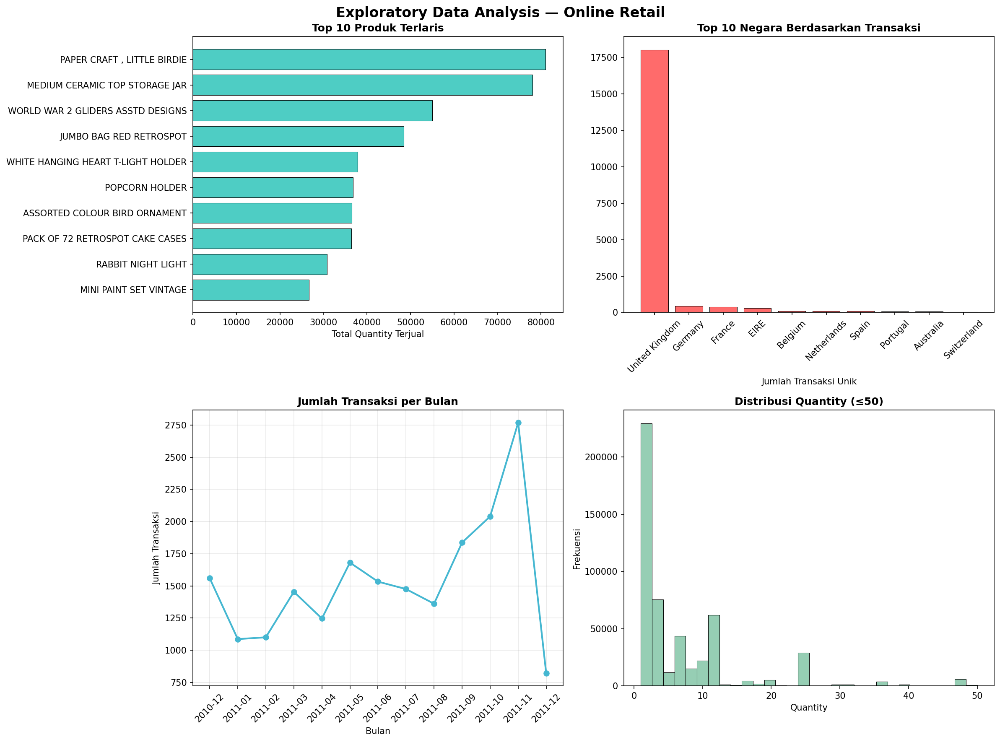
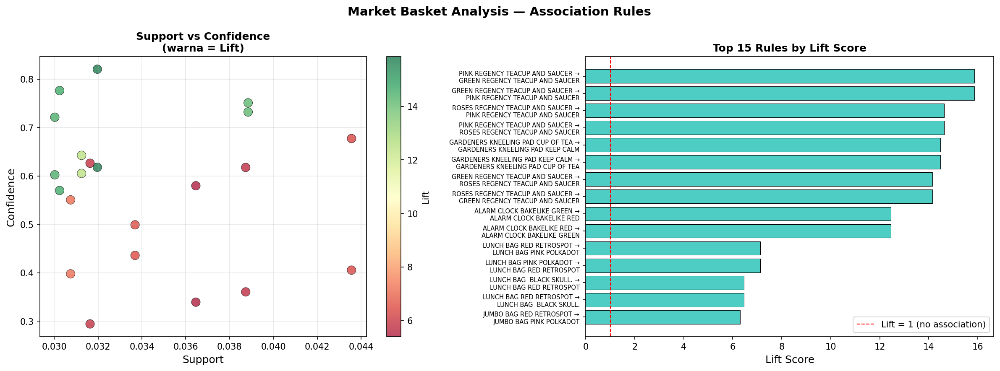

# 🛒 Market Basket Analysis
### Online Retail Association Rules with Apriori Algorithm

---

## 📌 Overview
This project analyzes online retail transaction data 
to discover product association patterns using the 
Apriori algorithm. The goal is to help retailers 
design effective cross-selling strategies, product 
bundling, and store layout optimization.

---

## 🎯 Business Problem
An online retailer wants to understand:
- Which products are frequently bought together?
- How strong are the associations between products?
- What marketing strategies can increase revenue?

---

## 🛠️ Tools & Libraries
- **Language:** Python 3
- **Libraries:** Pandas, NumPy, Matplotlib,
  Seaborn, MLxtend
- **Environment:** Jupyter Notebook

---

## 📊 Dataset
- **Source:** UCI Machine Learning Repository
- **Size:** 541,909 transactions, 8 features
- **Period:** 2010-2011
- **Country Focus:** United Kingdom (91% of data)

---

## 🔍 Methodology
1. **Data Understanding** — Explore 541,909 transactions
2. **Data Cleaning** — Remove cancelled transactions,
   negative quantities, and missing values
3. **EDA** — Analyze top products, countries & trends
4. **Basket Matrix** — Transform to binary format
5. **Apriori Algorithm** — Find frequent itemsets
6. **Association Rules** — Generate & evaluate rules
7. **Business Insights** — Actionable recommendations

---

## ⚙️ Parameters Used
| Parameter | Value | Reason |
|---|---|---|
| min_support | 0.03 | Medium-large dataset |
| min_confidence | 0.1 | Many unique products |
| min_lift | 1.2 | Meaningful association |

---

## 📈 Key Results

### EDA Insights

### Association Rules Visualization  

---

## 💡 Key Findings

### Top Product Groups with Strong Association:
- 🫖 **Regency Teacup Collection** 
  (Pink, Green, Rose variants)
- 🌱 **Gardeners Products** 
  (frequently bought as complete kit)
- ⏰ **Alarm Clock** 
  (home decoration cluster)

### Rules Summary:
| Category | Rules | Lift Range |
|---|---|---|
| 🟢 Very Strong | 10 | Lift ≥ 10 |
| 🟡 Strong | 6 | Lift 7-10 |
| 🔴 Moderate | 6 | Lift 5-7 |

---

## 💼 Business Recommendations

1. **Product Bundling** — Create bundle packages
   for rules with Lift ≥ 10
2. **Product Placement** — Place associated products
   next to each other in store
3. **Inventory Management** — Ensure paired products
   are always available simultaneously

---

## 🚀 How to Run
1. Clone this repository
2. Install requirements:
   pip install pandas numpy matplotlib 
   seaborn mlxtend openpyxl
3. Open market_basket_analysis.ipynb
4. Run all cells

---

## 👤 Author
**Mohammad Taufik Ibrahim**
- 🔗 LinkedIn: linkedin.com/in/taufikibraahim
- 📧 Email: taufikibraahim@gmail.com
